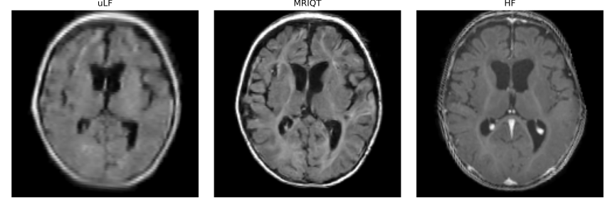

# MRIQT: Physics-Aware Diffusion Model for Image Quality Transfer in Neonatal Ultra-Low-Field MRI

[[Paper on Arxiv](https://arxiv.org/abs/XXXX.XXXXX)]

This repository hosts the offical PyTorch implementation and pretrained model weights for our paper "MRIQT: Physics-Aware Diffusion Model for Image Quality Transfer in Neonatal Ultra-Low-Field MRI". 
<!-- which has been accpeted for publication in the IEEE International Symposium on Biomedical Imaging (ISBI 2026)-->
Portable ultra-low-field MRI (uLF-MRI, 0.064 T) offers accessible neuroimaging for neonatal care but suffers from low signal-to-noise ratio and poor diagnostic quality compared to high-field (HF) MRI. We propose MRIQT, a 3D conditional diffusion framework for image quality transfer (IQT) from uLF to HF MRI. MRIQT combines realistic K-space degradation for physics-consistent uLF simulation, v-prediction with classifier-free for stable image-to-image generation, and an SNR-weighted 3D perceptual loss for anatomical fidelity. The model denoises from a noised uLF input conditioned on the same scan, leveraging volumetric attention-UNet architecture for structure-preserving translation. Trained on a neonatal cohort with diverse pathologies, MRIQT surpasses recent GAN and CNN baselines in PSNR 15.3% with 1.78% over the state of the art, while physicians rated 85% of its outputs as good quality with clear pathology present. MRIQT enables high-fidelity, diffusion-based enhancement of portable ultra-low-field (uLF) MRI for reliable neonatal brain assessment.


<p align="center">
    
</p>

**Figure 1 - MRIQT overview.** MRIQT restores fine anatomical structures and contrast
in portable uLF scans, producing HF-like images.

<!-- 
**Figure 1 — MRIQT overview.** Physics-aware diffusion model for image quality transfer from ultra-low-field (uLF) to high-field (HF) neonatal MRI, illustrating paired training, the learned transfer function, and the inference pipeline.
 -->


## Setup

To train/test our model:

    git clone git@github.com:albarqounilab/MRIQT.git && cd MRIQT


Then run the environment setup with conda:


    conda env create -f env.yml && conda activate mriqt


## Usage

### Models

We trained 2 models:
1. MRIQT: a Diffusion model for image quality transfer
2. A 3D-VGG like feature extractor for perceptual loss

To test our work, the ccorresponding weights for both models need to be downloaded and placed in `models`. The weights are available upon request.
<!-- 

- [mriqt_model.pt](https://uni-bonn.sciebo.de/s/9CmBbXBiKefpRRj)
- [feature_extractor.pth](https://uni-bonn.sciebo.de/s/LwT2FPJXFCacGap) 
-->


### Test on a Data sample
----
As a preprocessing step during training and testing, we use the 0-2 month (00-02) age-appropriate T1w brain template from the NIHPD Objective 2 atlas. Kindly download it and place it in `data`:

- [NIHPD Objective 2 model comparison](https://www.bic.mni.mcgill.ca/~vfonov/nihpd/obj2/models.html)

After downloading the model weights, run:

    python inference.py --ulf_path /Path/To/Your/uLF/Sample.nii.gz --checkpoint=models/mriqt_model.pt 

### Train on your Own Dataset 
-----
#### Prepare your data in [BIDS format](https://bids.neuroimaging.io/index.html). 
    
    python data/preprocess_dataset.py

| subject_id | hf |
| --- | --- |
| sub-01 | dataset/sub-01/ses-31122025/anat/sub-01_ses-31122025_run-01_acq-highres_T1w.nii.gz |
| sub-02 | dataset/sub-02/ses-01012025/anat/sub-02_ses-01012025_run-01_acq-highres_T1w.nii.gz |
| ...


#### Generate your own transfer function from your paired data 
----
- Since our dataset is a private property of The University Hospital Bonn, we provide the transfer fucntion computed using our dataset upon request and corresponding approval.


    `python data/compute_transfer_function.py`


#### Run the training script
----
Our training script is equipped to receive a csv file with 'subject_id' and 'hf' columns with 'ulf' column optionally if paired training. 'hf' (and 'ulf') contain the full paths to each high-field (and ultra-low-field) MRI scan, therefore, prepare accoridngly. 


Then run `python train.py`. Adjust the arguments accordingly. 


## Citation

If you use this code for your research, kindly cite our paper.


```bibtex
@article{XXXXXXXXXX,
    title = {MRIQT: Physics-Aware Diffusion Model for Image Quality Transfer in Neonatal Ultra-Low-Field MRI},
    author = {},
    year = {2025},
    journal = {arXiv preprint arXiv:XXXX.XXXXX}, OR ISBI
    note = {Code: \url{https://github.com/albarqounilab/MRIQT}}
}
```


## Acknowledgment

Code base adapted from [med-ddpm](https://github.com/mobaidoctor/med-ddpm).

## Disclaimer 
The code has been cleaned and polished for the sake of clarity and reproducibility, and even though it has been checked thoroughly, it might contain bugs or mistakes. Please do not hesitate to open an issue to inform of any problem you may find within this repository.

## Compliance with ethical standards. 
This study was performed in line with the principles of the Declaration of Helsinki. Approval was granted by the Ethics Committee of UniBonn (Ethics Nr. 167/22).

## License
The source code is licensed under GPL-3.0.  
The pretrained models and figures are licensed under 
[CC BY-NC-ND 4.0](https://creativecommons.org/licenses/by-nc-nd/4.0/).
